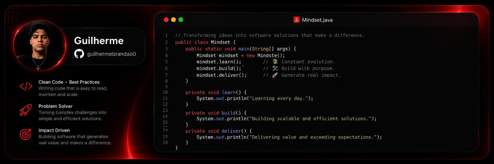

  

<h1 align="center">Maratona Java!!</h1>

###

Welcome to my Java studies.

###

I'm Guilherme Brandao, I'm 15 years old.

###

I'm taking this course on YouTube on the channel <a href="https://www.youtube.com/playlist?list=PL62G310vn6nFIsOCC0H-C2infYgwm8SWW" target="_blank"> DevDojo☕ </a>

###

In this course, I show my journey learning Java from beginner to advanced levels.

###

<h2 align="left">Techs used</h2>

###

  
  
  

###

  

###
